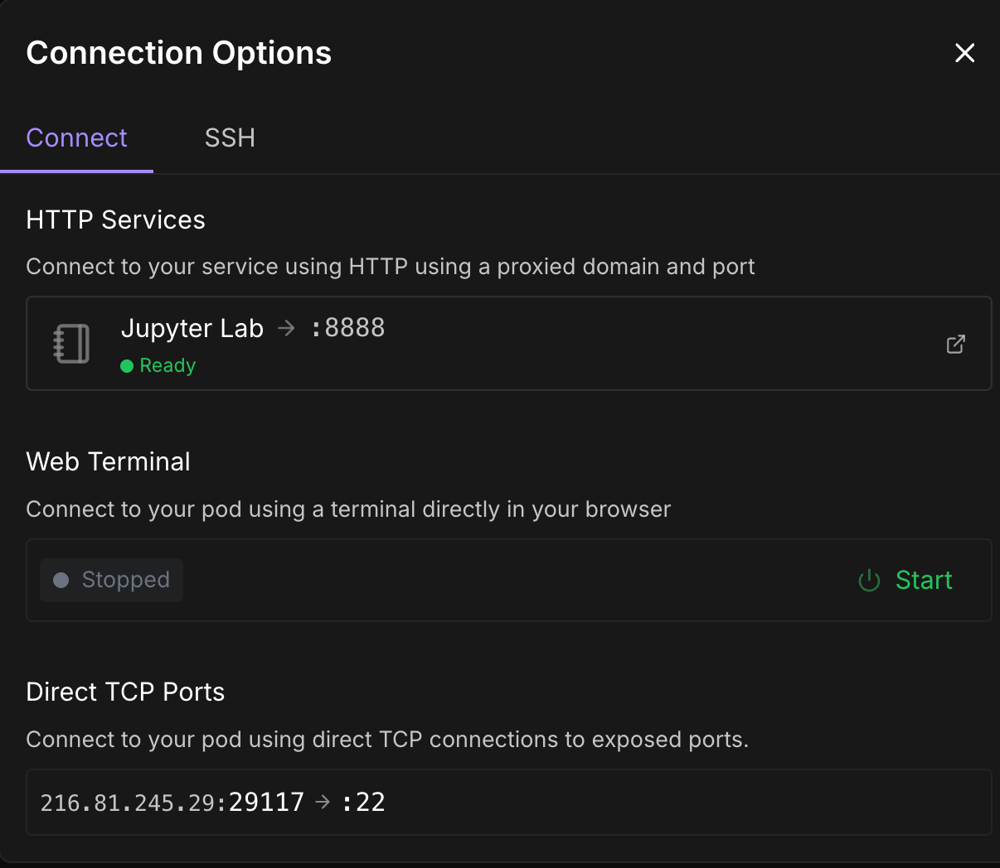

# Fine-tuning Mistral-7B with Axolotl on RunPod: Complete Tutorial

## Project Overview

In this comprehensive tutorial series, we'll walk through the entire process of fine-tuning Mistral-7B-Instruct-v0.3 using Axolotl on RunPod, then deploying it with vLLM and building a web application using Next.js. This tutorial is designed for data science students with beginner to intermediate experience.

### What You'll Learn
- Setting up and configuring RunPod instances for model fine-tuning
- Using Axolotl framework for efficient fine-tuning
- Merging and deploying fine-tuned models
- Converting models to GGUF format
- Uploading models to HuggingFace Hub
- Best practices for model training and deployment

### End Goal
By the end of this tutorial, you'll have:
- A fine-tuned Mistral-7B model trained on your custom dataset
- A merged model ready for deployment
- Optional GGUF conversion for efficient inference
- Your model published on HuggingFace Hub

---

## Prerequisites & Account Setup

### 1. HuggingFace Account Setup

Before we begin training, you'll need to set up several accounts and prepare your data.

**Step 1: Create HuggingFace Account**
1. Go to [HuggingFace](https://huggingface.co) and create an account
2. Verify your email address

**Step 2: Get Access Token**
1. Navigate to [HuggingFace Settings > Tokens](https://huggingface.co/settings/tokens)
2. Create a new token with **Read** permissions (this is sufficient for fine-tuning)
3. Copy and save this token securely - you'll need it later


**Step 3: Request Model Access**
1. Go to the [Mistral-7B-Instruct-v0.3 model page](https://huggingface.co/mistralai/Mistral-7B-Instruct-v0.3)
2. Click "Request Access" 
3. Fill out the contact information form
4. Agree to share your contact information
5. Submit the request - access is usually granted within a few hours


---

## Data Preparation Tools

I've created two Python scripts to help you prepare your training data:

### Tools Available
- **`data-preparation/input.py`**: Interactive JSON data inputter
- **`data-preparation/convert.py`**: Converts to Alpaca format and uploads to HuggingFace

### Usage
```bash
cd data-preparation
python input.py    # Create your training data
python convert.py  # Convert and upload to HuggingFace
```

---

## RunPod Setup

### 1. Account Creation
1. Go to [RunPod](https://runpod.io) and create an account
2. Add payment information (you'll only pay for what you use)
3. Navigate to the sidebar and select "Fine-tuning"

### 2. Choosing Your Approach

You have two options:
- **Use RunPod's Fine-tuning Template** (recommended for beginners)
- **Custom Setup**: If you want to learn the underlying code, check out my [Mistral Fine-tune GGUF Export repository](https://github.com/1bytess/mistral-finetune-gguf-export)

For this tutorial, we'll use the fine-tuning template for simplicity.

### 3. Configuration Setup

**Required Inputs:**
- **Base Model**: `mistralai/Mistral-7B-Instruct-v0.3`
- **HuggingFace Token**: Your token from the previous step (mandatory)
- **Private Dataset**: Your HuggingFace dataset name (e.g., `bytess/zrah-personal-ai`)


### 4. GPU Selection

Choose your GPU based on your budget and training requirements:

| GPU Type | VRAM | Recommended For | Approximate Cost/hr |
|----------|------|-----------------|-------------------|
| RTX 4090 | 24GB | Development/Testing | $0.50 |
| A100 40GB | 40GB | Production Training | $1.89 |
| A100 80GB | 80GB | Large Datasets | $2.89 |
| H100 | 80GB | Fastest Training | $4.25 |

For Mistral-7B fine-tuning, **RTX 4090 (24GB)** is sufficient and cost-effective.

### 5. Pod Deployment

1. **Pod Name**: Enter a descriptive name (e.g., `mistral-7b-finetune`)
2. **Select GPU**: Choose your preferred GPU from the table above
3. **Click "Deploy On-Demand"**
4. Wait for the instance to initialize (usually 2-5 minutes)


---

## Environment Setup & Configuration

### 1. Connecting to Your Instance

Once your pod is running:
1. **Monitor the logs** to track package installation progress
2. Wait for "Ready" status
3. Connect via **SSH** or **Web Terminal** (Web Terminal is easier for beginners)



### 2. Creating Axolotl Configuration

Navigate to your workspace and create the configuration file:

```bash
nano config.yml
```

### 3. Axolotl Configuration

Copy and paste this configuration into your `config.yml` file:

```yaml
adapter: lora
base_model: mistralai/Mistral-7B-Instruct-v0.3
model_type: MistralForCausalLM
tokenizer_type: AutoTokenizer
bf16: true
dataset_processes: 32

datasets:
  - path: bytess/zrah-personal-ai  # Replace with your dataset
    type: alpaca

gradient_accumulation_steps: 4
gradient_checkpointing: false
learning_rate: 0.0002

# LoRA Configuration
lora_alpha: 32
lora_dropout: 0.05
lora_r: 16           # Or try 8 for smaller size later
lora_target_modules:
  - q_proj
  - v_proj
  - k_proj
  - o_proj
  - gate_proj
  - down_proj
  - up_proj

loraplus_lr_embedding: 1.0e-06
lr_scheduler: cosine
max_prompt_len: 512
micro_batch_size: 4  # Increase from 2 if GPU allows
num_epochs: 3
optimizer: adamw_torch
output_dir: ./outputs/zrah_model

# Optimization Settings
pretrain_multipack_attn: true
sample_packing_bin_size: 200
sample_packing_group_size: 100000
save_only_model: true
save_safetensors: true
sequence_len: 2048
shuffle_merged_datasets: true
train_on_inputs: false

trl:
  use_vllm: false

val_set_size: 0.0
weight_decay: 0.0
```

**Pro Tips for Configuration Editing:**
- Use `Ctrl+Shift+6` to mark and select code using arrow keys
- Use `Ctrl+K` to cut selected text
- Use `Cmd+V` or `Ctrl+V` to paste
- Use `Ctrl+X` then `Y` to save and exit

### 4. Configuration Explanation

**Key Parameters:**
- **LoRA (Low-Rank Adaptation)**: Efficient fine-tuning method that only trains a small subset of parameters
- **lora_r: 16**: Rank of the adaptation - higher values = more parameters but better adaptation
- **learning_rate: 0.0002**: Conservative learning rate to prevent overfitting
- **num_epochs: 3**: Number of training passes through your dataset
- **micro_batch_size: 4**: Batch size per GPU - adjust based on your GPU memory
- **sequence_len: 2048**: Maximum sequence length for training

---

## Training Process

### 1. Starting the Training

Save your configuration file and start training:

```bash
axolotl train config.yml
```

The training process will:
1. Download the base model (if not cached)
2. Load your dataset
3. Initialize the LoRA adapters
4. Begin training with progress tracking
5. Save checkpoints to `./outputs/zrah_model`

**Training typically takes 1-3 hours depending on your dataset size and GPU choice.**

### 2. Monitoring Training

**Useful Commands:**
```bash
# Monitor GPU usage
nvidia-smi

# Check training logs
tail -f train.log

# List output files
ls -la ./outputs/zrah_model/
```

---

## Post-Training: Model Merging and Deployment

### 1. Merge LoRA Adapters with Base Model

After training completes, you need to merge the LoRA adapters with the base model for deployment.

Create a Python script for merging:

```bash
nano merge_model.py
```

Add the following code:

```python
from transformers import AutoModelForCausalLM, AutoTokenizer
from peft import PeftModel

# Set paths
base_model_id = "mistralai/Mistral-7B-Instruct-v0.3"
lora_path = "./outputs/zrah_model"  # Change this to your LoRA path
merged_path = "./merged_zrah_model"

# Load base model
base_model = AutoModelForCausalLM.from_pretrained(
    base_model_id,
    torch_dtype="auto"
)

# Load and merge LoRA
model = PeftModel.from_pretrained(base_model, lora_path)
model = model.merge_and_unload()  # Merge LoRA into base model

# Save merged model
model.save_pretrained(merged_path, safe_serialization=True)

# Optional: Save tokenizer
tokenizer = AutoTokenizer.from_pretrained(base_model_id)
tokenizer.save_pretrained(merged_path)

print(f"Merged model saved at {merged_path}")
```

Run the merge script:

```bash
python merge_model.py
```

### 2. Optional: Convert to GGUF Format

GGUF format provides efficient inference with reduced memory usage. This step is optional but recommended for deployment.

**Step 1: Download llama.cpp**
```bash
git clone https://github.com/ggerganov/llama.cpp
cd llama.cpp
make -j
```

**Step 2: Install Dependencies**
```bash
pip install -r requirements.txt
```

**Step 3: Convert to GGUF**
```bash
python3 convert_hf_to_gguf.py --outfile ../zrah-model.gguf --outtype q8_0 ../merged_zrah_model
```

---

## Publishing to HuggingFace Hub

### 1. Login to HuggingFace

Install the HuggingFace CLI and login:

```bash
# Install huggingface_hub if not already installed
pip install huggingface_hub

# Login to your Hugging Face account
huggingface-cli login
```

Enter your HuggingFace token when prompted (the same token you created earlier).

### 2. Upload Your Models

**Upload the merged PyTorch model:**
```bash
huggingface-cli upload your-username/your-repo-name merged_zrah_model/ --repo-type model
```

**Upload the GGUF model (if created):**
```bash
huggingface-cli upload your-username/your-repo-name zrah-model.gguf --repo-type model
```

**Replace `your-username/your-repo-name` with your actual HuggingFace username and desired repository name.**

---

## Troubleshooting

### Common Issues and Solutions

**Training Issues:**
- **CUDA Out of Memory**: Reduce `micro_batch_size` or `sequence_len`
- **Dataset Loading Errors**: Verify your HuggingFace token and dataset path
- **Model Access Denied**: Ensure you've been granted access to Mistral-7B-Instruct-v0.3

**Merging Issues:**
- **Import Errors**: Ensure all required packages are installed (`transformers`, `peft`)
- **Memory Issues**: Use a GPU instance with sufficient VRAM for merging

**Upload Issues:**
- **Authentication Errors**: Re-run `huggingface-cli login` with a valid token
- **Repository Not Found**: Create the repository on HuggingFace Hub first

### Performance Optimization Tips

1. **For Faster Training:**
   - Use higher-end GPUs (A100, H100)
   - Increase `micro_batch_size` if GPU memory allows
   - Enable `gradient_checkpointing: true` to save memory

2. **For Better Results:**
   - Increase `num_epochs` for more training
   - Adjust `learning_rate` based on your dataset
   - Experiment with different `lora_r` values

3. **For Smaller Models:**
   - Reduce `lora_r` to 8 or 4
   - Use quantization during conversion

---

## Next Steps and Advanced Topics

### Deployment Options
- **vLLM**: High-performance inference server
- **Ollama**: Local deployment with GGUF models
- **FastAPI**: Custom API endpoints
- **Gradio/Streamlit**: Quick web interfaces

### Model Evaluation
- Test your model with sample prompts
- Compare outputs with the base model
- Measure performance metrics relevant to your use case

### Production Considerations
- Model versioning and experiment tracking
- A/B testing different model versions
- Monitoring inference performance
- Cost optimization strategies

---

## Conclusion

Congratulations! You've successfully fine-tuned Mistral-7B using Axolotl, merged the model, and published it to HuggingFace Hub. This workflow provides a solid foundation for creating custom language models tailored to your specific use cases.

### What You've Accomplished
- ✅ Set up RunPod for GPU-accelerated training
- ✅ Configured Axolotl for efficient LoRA fine-tuning
- ✅ Trained a custom Mistral-7B model
- ✅ Merged LoRA adapters with the base model
- ✅ Optionally converted to GGUF format
- ✅ Published your model to HuggingFace Hub

### Resources for Further Learning
- [Axolotl Documentation](https://github.com/OpenAccess-AI-Collective/axolotl)
- [HuggingFace Transformers Documentation](https://huggingface.co/docs/transformers)
- [LoRA Paper](https://arxiv.org/abs/2106.09685)
- [RunPod Documentation](https://docs.runpod.io/)

Happy fine-tuning!