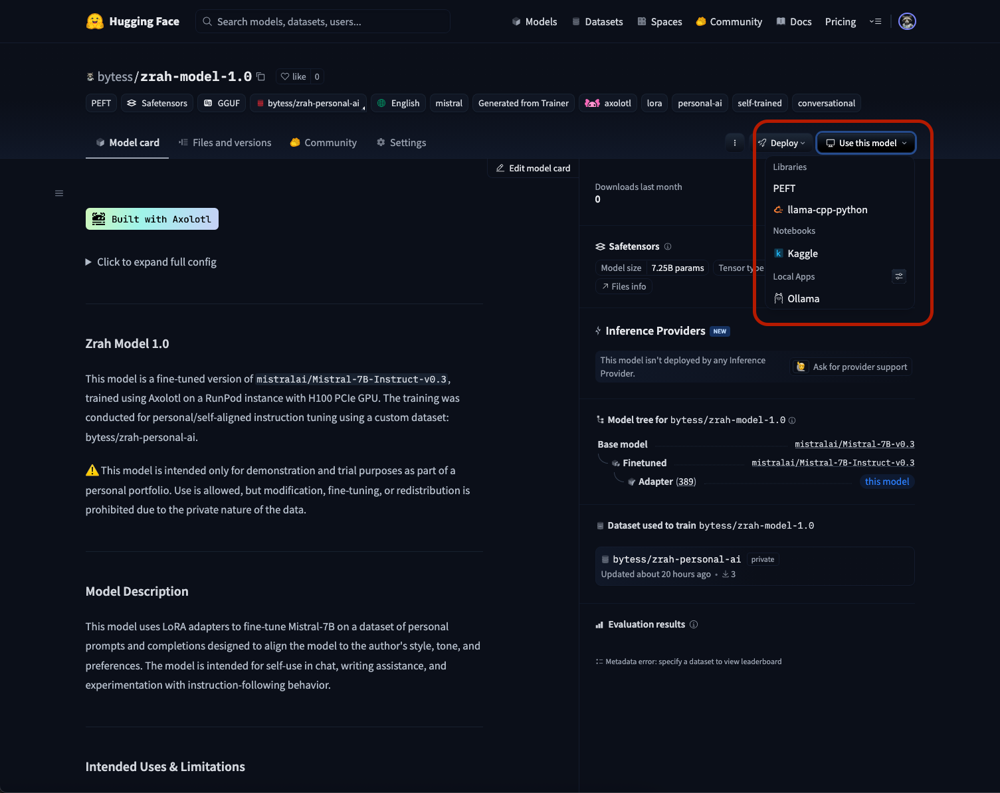
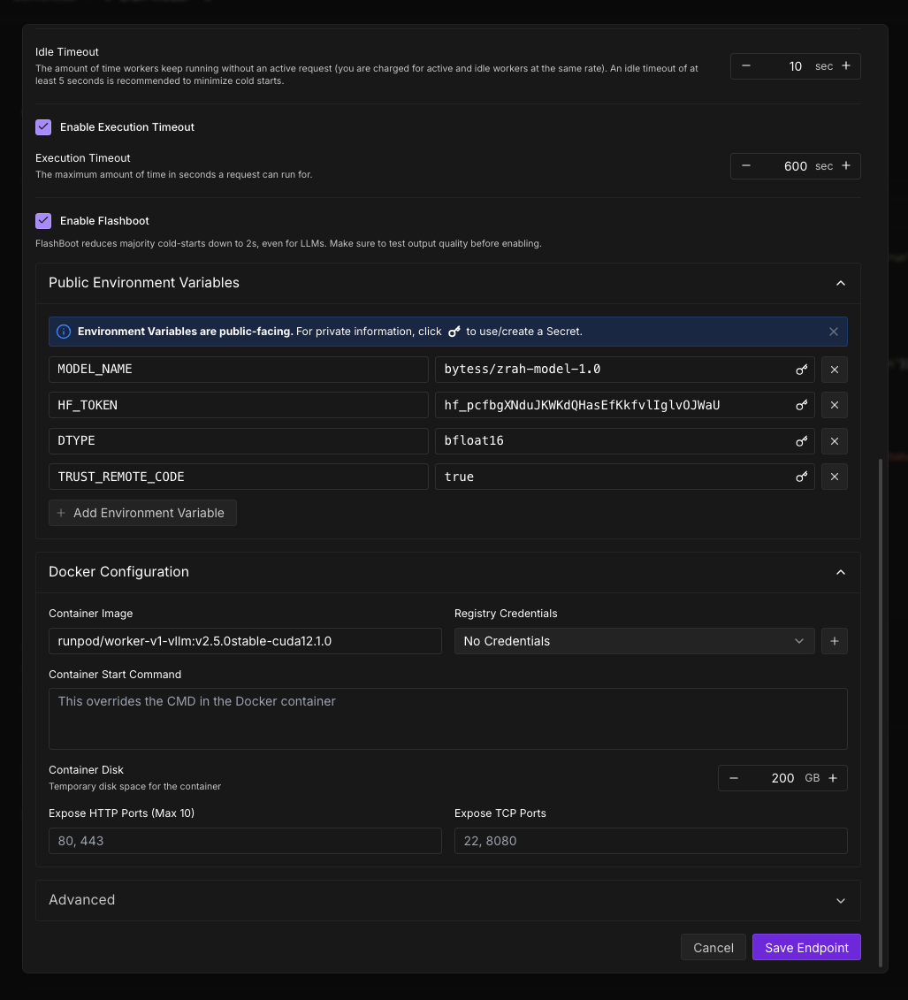
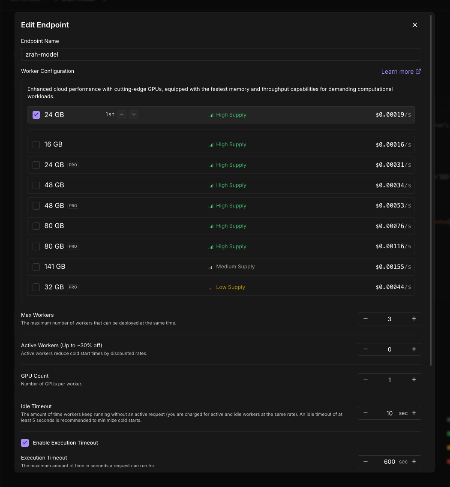

# Running Your Fine-tuned AI Model: Ollama & vLLM Deployment Tutorial

## Project Overview

This tutorial is part of the **RunPod Training and Inference Series**. After successfully fine-tuning your Mistral-7B model (from our previous tutorial), it's time to deploy and run your custom AI model for inference. We'll cover two popular deployment methods:

1. **Ollama** - Simple local deployment with GGUF models
2. **vLLM on RunPod** - High-performance serverless inference

### Prerequisites
- Completed the [Fine-tuning Mistral-7B tutorial](../mistral_finetune_tutorial.md)
- Your fine-tuned model uploaded to HuggingFace Hub
- Basic understanding of API endpoints and model inference

### What You'll Learn
- Deploy models locally using Ollama
- Set up serverless vLLM inference on RunPod
- Test your deployed models
- Integrate with web applications
- Best practices for model deployment

---

## Method 1: Local Deployment with Ollama

Ollama provides the simplest way to run your fine-tuned model locally. It's perfect for development, testing, and personal use.

### Step 1: Install Ollama

**For macOS:**
```bash
brew install ollama
```

**For Linux:**
```bash
curl -fsSL https://ollama.ai/install.sh | sh
```

**For Windows:**
Download from [ollama.ai](https://ollama.ai) and follow the installation instructions.

### Step 2: Run Your Model from HuggingFace

This is the easiest method - Ollama can directly pull and run models from HuggingFace Hub.

1. **Go to your HuggingFace model repository** (e.g., `https://huggingface.co/bytess/zrah-model-1.0`)
2. **Click "Use this model"** in the top right
3. **Select "Ollama"** from the dropdown menu
4. **Copy the provided command**



### Step 3: Deploy Your Model

Run the copied command in your terminal:

```bash
ollama run hf.co/bytess/zrah-model-1.0
```

**What happens next:**
- Ollama downloads your model from HuggingFace
- Converts it to optimized format automatically
- Starts an interactive chat session
- Your model is now ready for inference!

### Step 4: Using Your Model

**Interactive Chat:**
```bash
ollama run hf.co/bytess/zrah-model-1.0
>>> Hello! How can you help me today?
```

**API Usage:**
```bash
# Start Ollama server (if not already running)
ollama serve

# Make API calls
curl http://localhost:11434/api/generate -d '{
  "model": "hf.co/bytess/zrah-model-1.0",
  "prompt": "Explain quantum computing in simple terms"
}'
```

**Python Integration:**
```python
import requests
import json

def chat_with_model(prompt):
    url = "http://localhost:11434/api/generate"
    data = {
        "model": "hf.co/bytess/zrah-model-1.0",
        "prompt": prompt,
        "stream": False
    }
    
    response = requests.post(url, json=data)
    return response.json()["response"]

# Example usage
response = chat_with_model("What is machine learning?")
print(response)
```

### Step 5: Integration with OpenWebUI

For a better user interface, you can use OpenWebUI:

```bash
# Install OpenWebUI
pip install open-webui

# Run OpenWebUI
open-webui serve

# Access at http://localhost:8080
```

In OpenWebUI:
1. Go to **Settings > Models**
2. Add your model: `hf.co/bytess/zrah-model-1.0`
3. Start chatting with your fine-tuned model!

---

## Method 2: High-Performance Deployment with vLLM on RunPod

vLLM provides optimized, high-throughput inference perfect for production applications and serving multiple users.

### Step 1: Access RunPod Serverless

1. **Login to your RunPod account**
2. **Navigate to "Serverless"** in the sidebar
3. **Go to "Quick Deploy" section**
4. **Select "Serverless vLLM"** template


### Step 2: Configure Your Deployment

Fill in the deployment configuration:

**Required Configuration:**
- **Model Name**: `bytess/zrah-model-1.0` (your HuggingFace model path)
- **HuggingFace Token**: Your HF access token
- **DTYPE {auto,half,float16,bfloat16,float,float32}**: Data type for model weights and activations.
- **TRUST_REMOTE_CODE**: Trust remote code from huggingface.



### Step 3: Environment Variables

Configure additional settings as needed:

```bash
# Optional Environment Variables
HUGGING_FACE_HUB_TOKEN=your_hf_token_here
MAX_MODEL_LEN=2048
TRUST_REMOTE_CODE=true
QUANTIZATION=awq  # Optional: for smaller memory footprint
```

### Step 4: GPU Selection

Choose appropriate GPU based on your model size:

| Model Size | Recommended GPU | VRAM | Cost/hr (approx) |
|------------|----------------|------|------------------|
| 7B Parameters | RTX 4090 | 24GB | $0.50 |
| 7B Parameters | A100 40GB | 40GB | $1.89 |
| 13B+ Parameters | A100 80GB | 80GB | $2.89 |

**For Mistral-7B models, RTX 4090 or A100 40GB is sufficient.**



### Step 5: Deploy and Test

1. **Click "Deploy"**
2. **Wait for initialization** (2-5 minutes)
3. **Access the endpoint** once status shows "Running"

### Step 6: Testing Your vLLM Deployment

**Using the Built-in Interface:**
1. Click on your deployed endpoint
2. Navigate to the **"Requests"** tab
3. Use the interactive testing interface
4. Send sample prompts to test your model

**API Testing with cURL:**
```bash
curl -X POST "https://your-endpoint-id.runpod.net/v1/completions" \
     -H "Content-Type: application/json" \
     -H "Authorization: Bearer YOUR_RUNPOD_API_KEY" \
     -d '{
       "model": "bytess/zrah-model-1.0",
       "prompt": "Explain the concept of fine-tuning in AI",
       "max_tokens": 150,
       "temperature": 0.7
     }'
```

**Python Integration:**
```python
import requests
import json

class vLLMClient:
    def __init__(self, endpoint_url, api_key):
        self.endpoint_url = endpoint_url
        self.headers = {
            "Content-Type": "application/json",
            "Authorization": f"Bearer {api_key}"
        }
    
    def generate(self, prompt, max_tokens=150, temperature=0.7):
        data = {
            "model": "bytess/zrah-model-1.0",
            "prompt": prompt,
            "max_tokens": max_tokens,
            "temperature": temperature
        }
        
        response = requests.post(
            f"{self.endpoint_url}/v1/completions",
            headers=self.headers,
            json=data
        )
        
        return response.json()["choices"][0]["text"]

# Usage example
client = vLLMClient(
    endpoint_url="https://your-endpoint-id.runpod.net",
    api_key="your-runpod-api-key"
)

response = client.generate("What are the benefits of using fine-tuned models?")
print(response)
```

---

## Performance Comparison

| Method | Pros | Cons | Best For |
|--------|------|------|----------|
| **Ollama** | • Easy setup<br>• Local deployment<br>• No ongoing costs<br>• Great for development | • Limited by local hardware<br>• Single user<br>• Slower inference | Development, testing, personal use |
| **vLLM on RunPod** | • High performance<br>• Scalable<br>• Optimized inference<br>• Multiple concurrent users | • Ongoing costs<br>• Requires internet<br>• More complex setup | Production, multi-user applications |

---

## Integration with Web Applications

### Next.js Integration

For building web applications with your deployed model, check out our companion tutorial:

**📚 [Building Web Apps with Next.js](../building_webapp_nextjs/README.md)**

This tutorial covers:
- Setting up Next.js with your inference endpoints
- Building chat interfaces
- Handling streaming responses
- User authentication and session management
- Deployment strategies

### Quick Integration Example

```javascript
// pages/api/chat.js (Next.js API route)
export default async function handler(req, res) {
  const { message } = req.body;
  
  // For vLLM endpoint
  const response = await fetch('https://your-endpoint.runpod.net/v1/completions', {
    method: 'POST',
    headers: {
      'Content-Type': 'application/json',
      'Authorization': `Bearer ${process.env.RUNPOD_API_KEY}`
    },
    body: JSON.stringify({
      model: 'bytess/zrah-model-1.0',
      prompt: message,
      max_tokens: 150
    })
  });
  
  const data = await response.json();
  res.json({ reply: data.choices[0].text });
}
```

---

## Monitoring and Optimization

### Performance Metrics to Track

**For Ollama:**
- Response time per request
- Memory usage
- CPU utilization

**For vLLM:**
- Requests per second (RPS)
- Tokens per second
- GPU utilization
- Cost per request

### Optimization Tips

**Ollama Optimization:**
```bash
# Increase context window
ollama run hf.co/bytess/zrah-model-1.0 --context 4096

# Adjust temperature for different use cases
ollama run hf.co/bytess/zrah-model-1.0 --temperature 0.1  # More deterministic
ollama run hf.co/bytess/zrah-model-1.0 --temperature 0.9  # More creative
```

**vLLM Optimization:**
- Use appropriate GPU for your model size
- Enable quantization for memory efficiency
- Adjust `max_model_len` based on your use case
- Monitor and scale based on usage patterns

---

## Troubleshooting

### Common Ollama Issues

**Model not found:**
```bash
# List available models
ollama list

# Pull model manually if needed
ollama pull hf.co/bytess/zrah-model-1.0
```

**Memory issues:**
- Ensure sufficient RAM (at least 8GB for 7B models)
- Close other applications
- Consider using quantized models

### Common vLLM Issues

**Deployment fails:**
- Check HuggingFace token permissions
- Verify model path is correct
- Ensure sufficient GPU memory

**Slow inference:**
- Check GPU utilization in RunPod console
- Consider upgrading to faster GPU
- Optimize batch size settings

**API errors:**
- Verify endpoint URL format
- Check API key authentication
- Monitor request rate limits

---

## Cost Optimization

### Ollama (Local)
- **One-time cost**: Hardware investment
- **Ongoing costs**: Electricity (~$0.05-0.10/hour for high-end GPU)
- **Best for**: Personal use, development, small-scale applications

### vLLM on RunPod
- **Pay-per-use**: Only pay when inference is running
- **Scaling**: Automatically scale based on demand
- **Cost optimization tips**:
  - Use spot instances when available
  - Scale down during low-usage periods
  - Monitor usage patterns

---

## Security Considerations

### Ollama Security
- Models run locally - data never leaves your machine
- Perfect for sensitive or proprietary data
- No network dependencies once model is downloaded

### vLLM Security
- Data transmitted over HTTPS
- Use environment variables for API keys
- Consider VPC deployment for enterprise use
- Implement rate limiting and authentication

---

## Next Steps

### Immediate Actions
1. ✅ Choose your deployment method (Ollama vs vLLM)
2. ✅ Deploy your fine-tuned model
3. ✅ Test with sample prompts
4. ✅ Integrate with your application

### Advanced Topics
- **Load balancing** multiple model instances
- **A/B testing** different model versions
- **Custom inference optimizations**
- **Model serving at scale**

### Continue the Series
- **[Building Web Apps with Next.js](../building_webapp_nextjs/README.md)** - Create full-stack applications
- **[Model Evaluation and Monitoring](../model_evaluation/README.md)** - Track performance and quality
- **[Advanced Deployment Strategies](../advanced_deployment/README.md)** - Production-ready deployments

---

## Conclusion

You've successfully learned how to deploy your fine-tuned AI model using both Ollama and vLLM! 

### What You've Accomplished
- ✅ Deployed models locally with Ollama
- ✅ Set up high-performance vLLM inference on RunPod
- ✅ Tested both deployment methods
- ✅ Learned integration patterns for web applications
- ✅ Understood cost and performance trade-offs

### Key Takeaways
- **Ollama** is perfect for development and personal use
- **vLLM** excels in production and multi-user scenarios
- Both methods can integrate with web applications
- Choose based on your specific requirements and constraints

Your fine-tuned AI model is now ready to power real applications! In the next tutorial, we'll build a complete web application using Next.js to create a beautiful interface for your AI model.

### Resources
- [Ollama Documentation](https://ollama.ai/docs)
- [vLLM Documentation](https://vllm.readthedocs.io/)
- [RunPod Serverless Guide](https://docs.runpod.io/serverless/overview)
- [1bytess/series_of_runpod_training_and_inference](https://github.com/1bytess/series_of_runpod_training_and_inference)

Happy deploying! 🚀